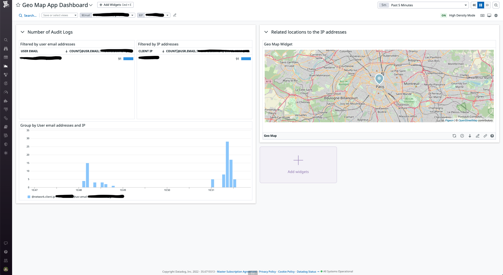

# Datadog Geomap App



## Description

This project shows you how to create a Datadog App with a custom
Widget.

-   [To learn more about Crystal](https://betterprogramming.pub/a-tale-of-two-engineers-discovering-the-crystal-programming-language-104b1fdbe525)
-   [to learn more about the Datadog Apps] - coming soon

## Prerequesites

-   Docker
-   A Datadog Account with:
    -   An API Key
    -   An application Key

## Getting Started

Clone the repo

```
$ git clone git@github.com:DataDog/apps.git
```

Change to Random Dog Directory

```
$ cd ./cd examples/geomap/
```

Copy the example env file and add yours

```
$ cp .env.example .env
```

Build the Docker images

```
$ docker-compose build
```

Launch the Docker containers and go to Datadog.
A Dashboard and an Datadog App has been created for you.

Search for the Datadog App Geo Map Dashboard.

```
$ docker-compose up
```

## Lauching the Crystal API only

Build the API

```
$ docker-compose -f docker-compose-api.yml build
```

Launch the API

```
$ docker-compose -f docker-compose-api.yml up
```

## Contributing

If you want to contribute to the project, don't hesitate to contact me at
thomas.dimnet@datadoghq.com.

There is also a docker-compose file for the dev env.
Build your Docker images

```
$ docker-compose -f docker-compose-dev.yml build
```

Launch your Docker containers

```
$ docker-compose -f docker-compose-dev.yml up
```

Then, you can bash into them

```
$ docker container exec -ti ${containerId} bash
```
