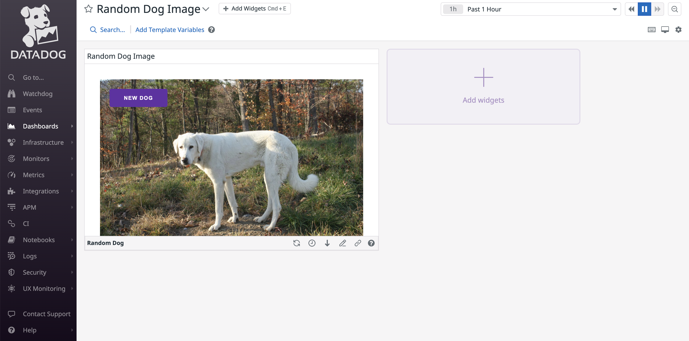

# Random Dog Image App



## Prerequesites

-   Docker
-   A Datadog Account with:
    -   An API Key
    -   An application Key
-   A Dog API Key: you can create an account for free at https://thedogapi.com

## Getting Started

Clone the repo

```
$ git clone git@github.com:DataDog/apps.git
```

Change to Random Dog Directory

```
$ cd ./cd examples/random-dog/
```

Copy the example env file and add yours

```
$ cp .env.example .env
```

Build the Docker images

```
$ docker-compose build
```

Launch the Docker containers and go to Datadog. A new Dashboard has been
created for you. Search for the Random Dog Image Dashboard.

```
$ docker-compose up
```

## Contributing

If you want to contribute to the project, don't hesitate to contact me at
thomas.dimnet@datadoghq.com.

There is also a docker-compose file for the dev env.
Build your Docker images

```
$ docker-compose -f docker-compose-dev.yml build
```

Launch your Docker containers

```
$ docker-compose -f docker-compose-dev.yml up
```

Then, you can bash into them

```
$ docker container exec -ti ${containerId} bash
```
