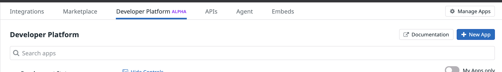

# Sample UI App

This app is a sample app mocking a usecase for Sentiment Analysis based off of the [@datadoghq](http://www.twitter.com/datadoghq) twitter feed.

# Usage

Once inside this folder, install all the necessary packages with your CLI of choice by running `npm i`. 

After that has completed, run `npm start` to get a local instance of the application running on your machine, take note of the port its using, we're going to assume it's using `3000` going forward. 

Now it's time to add the widget to your dashboard. 

Navigate to: [https://app.datadoghq.com/apps/](https://app.datadoghq.com/apps/) and click on "New App" on the top right. 

Now you want to give your application a name that makes sense and is easy for you to remember.

The next screen you'll see is the main information for your app, but we would like to configure it a bit more so lets click on `UI Extensions` in the left side menu.

This is the page that contains a lot of very helpful information for your application, for the sake of time we've already set one up for you. Just copy and paste the contents of [app-manifest.json](app-manifest.json) into the right hand editor on this page and it will configure everything we need. Hit `Save Changes` on the bottom right and we're ready to add the app to our Dashboard.

Navigate on over to [https://app.datadoghq.com/dashboard/lists](https://app.datadoghq.com/dashboard/lists) and create a new dashboard to use, or choose an existing one. 

Once you're on the dashboard of your choice, click on any of the places that say `Add Widget` to begin adding the one we just created. 

You will probably have to scroll all the way to the right to see the new widgets we have created, from there just drag and drop or click on the widget of your choice to add it.

Now you will have a pop up preview of your brand new widget, as well as any additional options you've passed in. The metric and cheese options are being controlled by the `app-manifest.json` file we mentioned previously. 

Hit done, and then resize the widget to the size of your choosing and you're ready to explore. 

https://user-images.githubusercontent.com/228230/127715995-aa66fb84-9900-4e88-bcb8-ea4340fa3cd8.mp4

This app demo shows usage of the side panel, modal, and they dashboard cog menu. To find out more about how to utilize the SDK please check out the documentation at [/docs/en](../../../docs/en)
