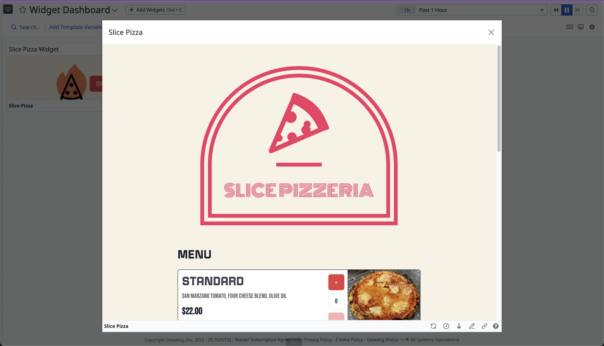

# Slice Pizza App



## 1. Description

Source code of the Slice Pizza Datadog App example.

## 2. Prerequesites

-   docker
-   a datadog account with:
    -   an api key
    -   an application key

## 3. Getting Started

Clone the repo

```
$ git clone git@github.com:DataDog/apps.git
```

Change to Pizza Widget Directory

```
$ cd ./examples/slice-pizza
```

Run the bootstrapping script and provide the necessary API Keys and configuration values when prompted

```
$ ./scripts/bootstrap.sh
```

Run the Docker images

```
$ docker-compose up
```

Launch the Docker containers and go to Datadog.

A Datadog App has been created for you in `Integrations` > `Developer Platform`.

Add the Slice Pizza Widget to one of your dashboards.

## 4. cURL Requests

### 4.1. Creating an user

```
curl --location --request POST 'http://localhost:5000/api/users' \
--header 'Content-Type: application/json' \
--data-raw '{
    "name": "username",
    "email": "username@example.com",
    "password": "password",
    "address": "Hooiland 20, 5663HC Geldrop"
}'
```

### 4.2. Getting a token

```
curl --location --request POST 'http://localhost:5000/api/tokens' \
--header 'Content-Type: application/json' \
--data-raw '{
    "email": "username@example.com",
    "password": "password"
}'
```

### 4.3. Getting the menu

```
curl --location --request GET 'http://localhost:5000/api/menu?email=username@example.com' \
--header 'token: yourToken' \
--header 'Content-Type: application/json' \
--data-raw '{}'
```

### 4.4. Getting the cart

```
curl --location --request GET 'http://localhost:5000/api/cart?email=username@example.com' \
--header 'token: yourToken'
```

### 4.5. Updating the cart

```
curl --location --request POST 'http://localhost:5000/api/cart' \
--header 'token: yourToken' \
--header 'Content-Type: application/json' \
--data-raw '{
    "email": "username@example.com",
    "id": "da8e-9f48-eac6",
    "size": 10,
    "amount": 1
}'
```

### 4.6. Creating the order

```
curl --location --request POST 'http://localhost:5000/api/order' \
--header 'token: yourToken' \
--header 'Content-Type: application/json' \
--data-raw '{
    "email": "username@example.com"
}'
```

## 6. Contributing

If you want to contribute to the project, don't hesitate to contact me at
thomas.dimnet@datadoghq.com.

There is also a docker-compose file for the dev env.
Build your Docker images

```
$ docker-compose -f docker-compose-dev.yml build
```

Launch your Docker containers

```
$ docker-compose -f docker-compose-dev.yml up
```

Then, you can bash into them

```
$ docker container exec -ti ${containerId} bash
```

Finally, launch the appropriate commands:

### 6.1. Datadog App

```
$ yarn
$ yarn start
```

### 6.2. Api

```
$ node index.js
```

**Please note that the data, such as user, token, and pizza menu are stored in
the .data folder.**

### 6.3. Proxy

```
$ flask run --port=5000 --host=0.0.0.0
```

### 6.4. Setup

```
$ yarn
$ yarn start
```
