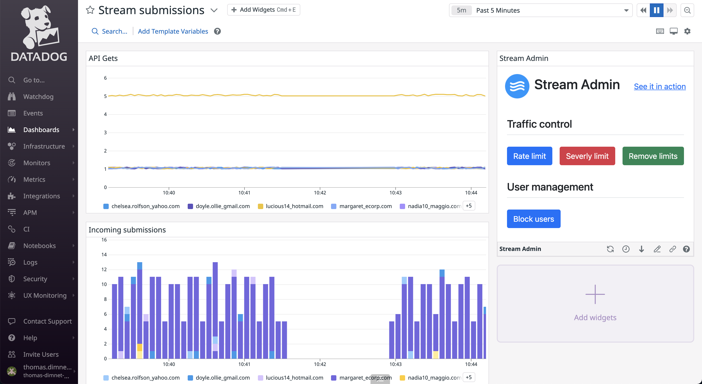

# Stream app



## Prerequesites

-   Docker
-   A Datadog Account with:
    -   An API Key
    -   An Application key

## Getting Started

Clone the repo

```
$ git clone git@github.com:DataDog/apps.git
```

Change to Stream directory

```
$ cd ./cd examples/stream/
```

Copy the example env file and add yours

```
$ cp .env.example .env
```

Build the Docker images

```
$ docker-compose build
```

Launch all your containers:

-   server: the back-end of the stream app
-   ui: the front-end of the stream (the Twitter like)
-   admin: the datadog app
-   setup: create your dashboard and your app on Datadog

```
docker-compose up
```
